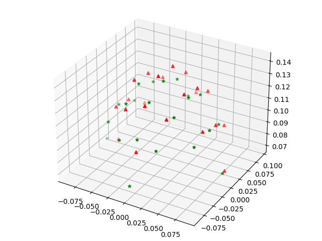
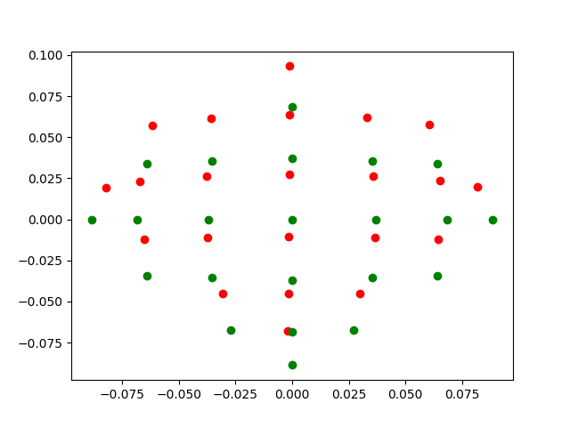
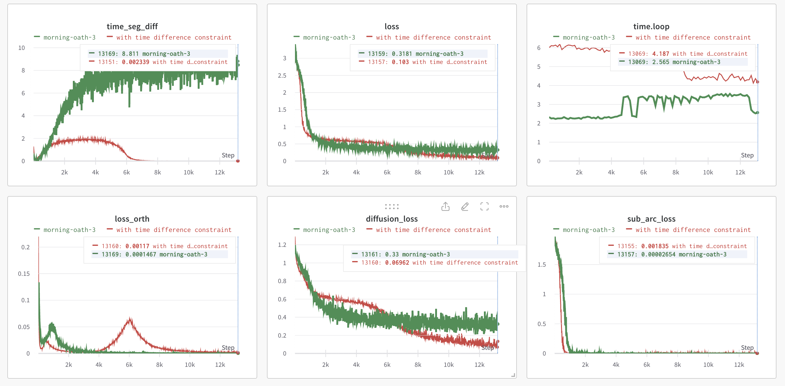

<div align="center">


# DS-DDPM
**Domain Specific Denoising Diffusion Probabilistic Models for Brain Dynamics/EEG Signals**

______________________________________________________________________

WIP ...

 []()
[](https://github.com/duanyiqun/DiffusionDepth/blob/main/LICENSE)


</div>


A minimum implementation of Domain Specific Denoising Diffusion Probabilistic Models for Brain Dynamics/EEG Signals

The intuition is simple, traditional EEG denoising methods normal apply blind source separation or frequency filtering.
We apply domain generation to model human subjects difference separation as a summation of domain generation and clean 
content denoising as figure shows below. 

To bettter illustrate the generated brain activity and compared it with the real sample, with give a illustration as bellow. The first row is the EEG sensor spatial relations (left for 3D spatial position, right for 2d projection). The second raw is the signal variance through time ( left for generated, rigth for real data).


<div align="center">
     
    <br>
</div>  
  

<div align="center">
<br>
     
    <br>
</div>


______________________________________________________________________
  

## Installation

Please install required pip packages
```ssh
pip install tensorboardx
pip install labml
pip install scikit-learn
pip install torch torchvision
pip instlal -r requirements.txt
```
If warning of any unfound versions , just install the latest version with conda.


## Training

The training entry scripts:
```bash
python unet2d_overlap.py
```
If you want use wandb to log metrics on webiste first run init 
```bash
wandb login
```
Please note that the currrent setting stacks time segments of EEG signals to form a long time series. The default setting is 244 time window with stride step 75. You can change it in the training file. 

One important problem is multiple logits for each time window may lead to multiple values for a same time point. We use a constraint to constraint different values associated to a same time point to be the same. You can use ``time_diff_constraint=True`` to control the constraint. 
To give a illustrate, we give a comparision example of the generated EEG signals with and without the constraint, where red denotes training with time diff constraint, green denotes training without time diff constraint. It illustrates the efficiency of our loss design. 


<div align="center">
    
    <br>
</div>

## Inference

Please config args as below as you training file give. Also set the runid to your trained checkpoints folder. Given the example below please set ```runid=34854f3ed38711edb808e4434b7714aa``` A sample structure under the log/experiment_name folder could be:

```sh
.
└── 34854f3ed38711edb808e4434b7714aa
    ├── checkpoints
    ├── configs.yaml
    ├── indicators.yaml
    ├── pids
    ├── run.yaml
    ├── source.diff
    └── wandb
```

The inference entry scripts:
```bash
python sample_save.py
```


The generated example of denoised EEG signals (blue) with separated noise (green). This method may also be used for other time sequence signals. Below is a sampled animation of the generated process of sampling sythetic EEG signals from noise given random noise and subjects. The noise decrease through time steps. The clean signal then rapidly take the lead of the whole process. 

<div align="center">
 
</div>


## 一些来自Nicolas Yang的补充
在运行前需要更改文件路径：（大概在文件 unet2d_overlap.py 的930行左右）
```bash
return DatasetLoader_BCI_IV_signle('train', datafolder='/你/的/数据/文件夹', subject_id=3)
```

515 行也要改
```bash
metric_file = '/content/DS-DDPM/metrics/none_constraint_subject_gaussion_unet_att_loss_ep100_withorga_arc_normalized.csv'
```

462行也要改
```bash
load_backbone = '/content/DS-DDPM/assets/max_acc.pth'
```